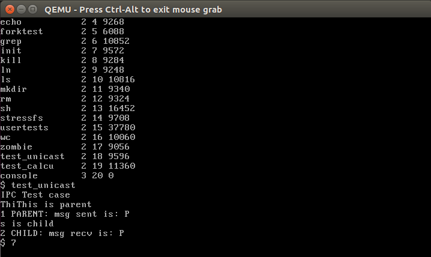
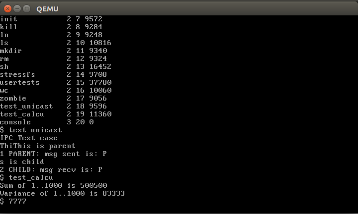

# 基于消息队列和信号的进程间通信

### 1. 消息队列

**消息队列结构体：**

为每一个进程维护一个消息队列

```c
struct msg_queue
{
    struct spinlock lock ;
    char data [ BUFFER_SIZE ][ MSGSIZE ];
    int start ;
    int end ;
    int channel ; // channel is used for sleep and wakeup
} MsgQueue [ NPROC ];
```

**系统调用**

```c
int send ( int sender_pid , int rec_pid , void *msg); // 发送消息
int recv ( void *msg); // 接收消息，阻塞的函数
```

**测试脚本**

测试命令：```test_unicast```，两个进程间通信，父进程向子进程发消息。



### 2. 基于信号

**函数和结构体**

发送方可以向接收方发送signal(sig_num 有0,1,2,3四种选项，sig_arg是参数)。

```c
int sig_send (int dest_pid , int sig_num , void * sig_arg );
```

接收方可以针对每一个sig_num设定一个处理函数

```c
int sig_set (int sig_num , sighandler_t handler );
```

接收方可以阻塞当前进程直到收到信号

```c
int sig_pause ( void );
```

每个进程结构体中有一个信号队列，用来保存收到的信号。

```c
struct sig_queue
{
struct spinlock lock ;
char sig_arg [ SIG_QUE_SIZE ][ MSGSIZE ];
int sig_num_list [ SIG_QUE_SIZE ];
int start ; // works as a channel ( for sleep and wakeup ) also
int end ;
};
```

**测试脚本**

测试命令：`test_calcu`。计算1...1000的和和方差。

1. 1..1000分成八份，八个子进程计算每部分的和。
2. 每个子进程将结果发送给原始进程，调用`sig_pause`等待下一步信息
3. 父进程计算和和均值，调用`sig_send`将均值发送给每个子进程。等待子进程结果。
4. 子进程的信号处理函数计算每部分的差的平方和，发送给父进程。
5. 父进程接收所有和，计算方差。




